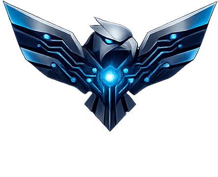

<div align="center">
  
  <h1>GARUD AI</h1>
  <p><strong>A Next-Generation Native Desktop Assistant</strong></p>
  <p><i>Cinematic Holographic UI • Multi-Agent Architecture • Voice & Vision Intelligence</i></p>
</div>

---

## ⚡ Overview

**GARUD** is an advanced, high-performance personal desktop assistant that bridges the gap between conversational AI and local system operations. Built with a premium, frameless **PyQt6** interface featuring a futuristic **holographic HUD**, GARUD isn't just a chatbot—it's an integrated AI operating system. 

It leverages a powerful **LangGraph multi-agent workflow** routed by a central supervisor, enabling it to autonomously execute tasks across your local file system, write code, browse the web, solve math, manage memory via ChromaDB, and even see through your webcam using YOLO-based computer vision.

---

## 🌟 Key Features

* **Cinematic Holographic UI:** A stunning, hardware-accelerated PyQt6 frameless window with interactive tech grids, particle systems, and an animated "Orb" that reacts to system state (Idle, Awake, Thinking).
* **Voice-First Interaction:** Integrated continuous listening via **Whisper** and native Text-to-Speech (QTextToSpeech). Just say `"wake up garud"` to start.
* **Multi-Agent Engine (LangGraph):** A specialized fleet of AI agents working together:
  * 💬 **Chat Agent:** General conversation and contextual memory.
  * 💻 **Code & Executor Agents:** Generates and runs Python code autonomously.
  * 📂 **File & System Agents:** Manages local files, searches directories, and executes OS-level operations.
  * 👁️ **Vision Agent:** Real-time object detection and visual analysis using YOLOv8.
  * 🌐 **Web Agent:** Browses the internet for real-time information (Tavily integration).
  * 🧮 **Math Agent:** Solves complex equations using SymPy.
* **Persistent Memory:** Contextual awareness and long-term memory powered by **ChromaDB** and Sentence-Transformers.

---

## 🛠️ Tech Stack

* **Frontend UI:** PyQt6 (Frameless Window, QPropertyAnimation, QPainter)
* **Workflow / Routing:** LangGraph, Ollama (Qwen/Llama models)
* **Voice:** Whisper (OpenAI), SpeechRecognition, PyQt6 QTextToSpeech
* **Vision:** OpenCV, YOLOv8 (`garud-vision` module)
* **Memory Backend:** ChromaDB, sentence-transformers
* **Tools & Utilities:** Tavily (Web Search), SymPy (Math)

---

## 🚀 Getting Started

### Prerequisites
* **Python 3.8+**
* An active Ollama installation (with models like `qwen2.5` or `llama3` pulled).

### 1. Clone the Repository
```bash
git clone https://github.com/aryannaikar/GARUD.git
cd GARUD
```

### 2. Install Dependencies
```bash
pip install -r requirements.txt
```
*(Note: For vision features, you may need to install the dependencies inside `garud-vision/requirements.txt` as well).*

### 3. Environment Variables
Create a `.env` file in the root directory and add any required API keys (e.g., for Tavily Web Search):
```env
TAVILY_API_KEY="your_tavily_key_here"
```

### 4. Run Garud
```bash
python main.py
```

### 5. Interaction
* **Voice:** Make sure your microphone is connected. Say **"Wake up Garud"** to activate voice listening mode.
* **Text:** Use the cinematic text input bar at the bottom of the HUD.
* **Drag & Move:** Click and drag anywhere on the UI to move the frameless window around your desktop.

---

## 📂 Project Structure

```text
GARUD/
├── main.py                 # Application entrypoint & PyQt6 UI Engine
├── core_api.py             # Whisper background listening & graph bridge
├── graph/                  # LangGraph state and workflow definitions
├── agents/                 # Specialized agent modules (Code, Vision, System, Web, etc.)
├── tools/                  # Tool implementations (ChromaDB, File manipulation, OS commands)
├── garud-vision/           # Standalone YOLOv8 object detection & tracker modules
├── image/                  # UI assets and logos
└── requirements.txt        # Core dependencies
```

---

<div align="center">
  <i>"I am awake. How can I help you?"</i>
</div>
